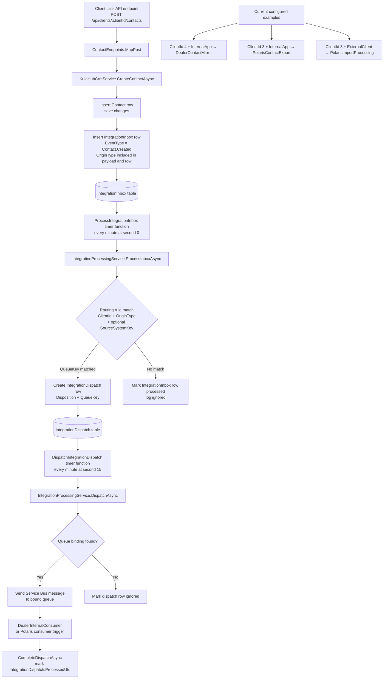
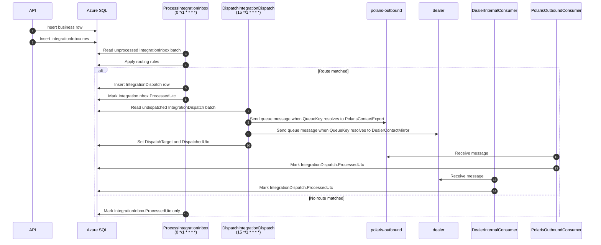
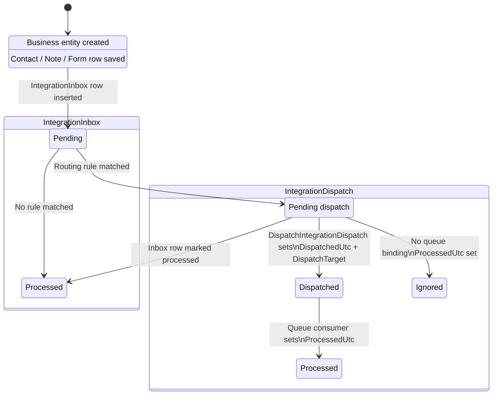

# Message Flow

This diagram shows the current end-to-end flow from an API write request through the inbox-processing pipeline and into the unified dispatch table and queue consumers.

## Notes

- The API writes the business entity first and then writes an `IntegrationInbox` row in the same application workflow.
- `ProcessIntegrationInbox` is the routing step that decides whether an inbox item becomes a dispatch row with a `QueueKey`, or is ignored.
- `DispatchIntegrationDispatch` is the single timer-triggered dispatch stage for queued work.
- The Service Bus consumer functions only complete the relevant `IntegrationDispatch` row after a queue message is received and processed.
- The current routing model stores both a logical `QueueKey` and the resolved physical `DispatchTarget` queue name.

## Execution Order

This view focuses on when each function runs and the normal order you would enable and observe them locally.

## Suggested Local Run Order

1. Run the API and submit a request.
2. Enable and run `ProcessIntegrationInbox` to watch routing occur.
3. Enable and run `DispatchIntegrationDispatch` to send queued work.
4. Enable and run the matching Service Bus consumer function to complete the integration row.

## Table State Transitions

This view focuses on how rows move through the integration tables.

### Meaning Of The Columns

- `IntegrationInbox.ProcessedUtc`: set when the inbox event has been classified.
- `IntegrationDispatch.DispatchedUtc`: set when a queue message has been sent.
- `IntegrationDispatch.ProcessedUtc`: set when the queue consumer has completed handling the message.
- `QueueKey`: stores the logical routing decision used to resolve the queue binding.
- `DispatchTarget`: stores the queue name used for dispatch, or `ignored` if no queue binding matched.