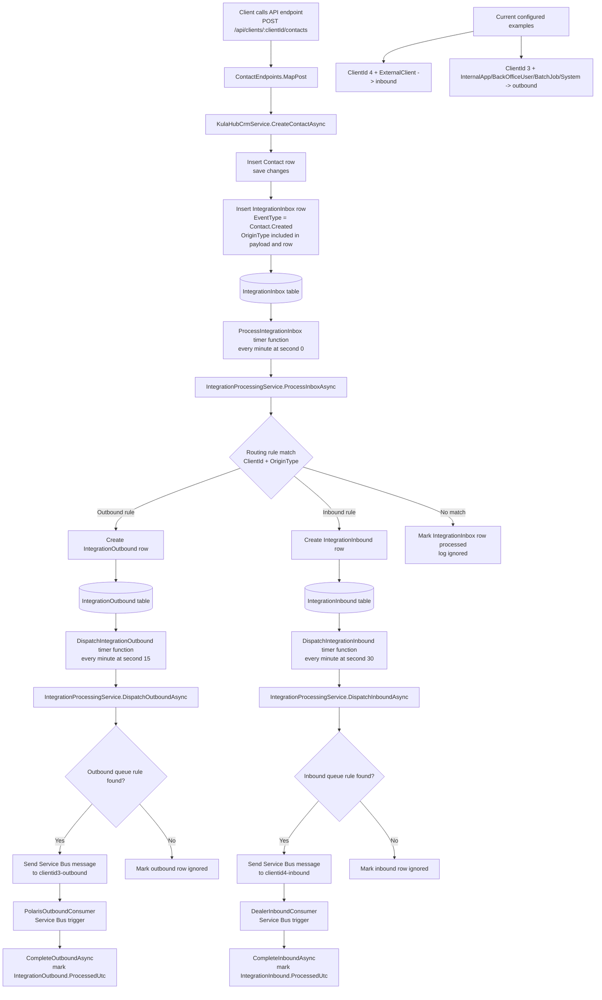
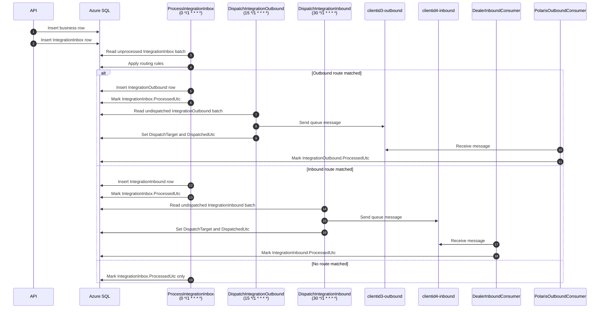
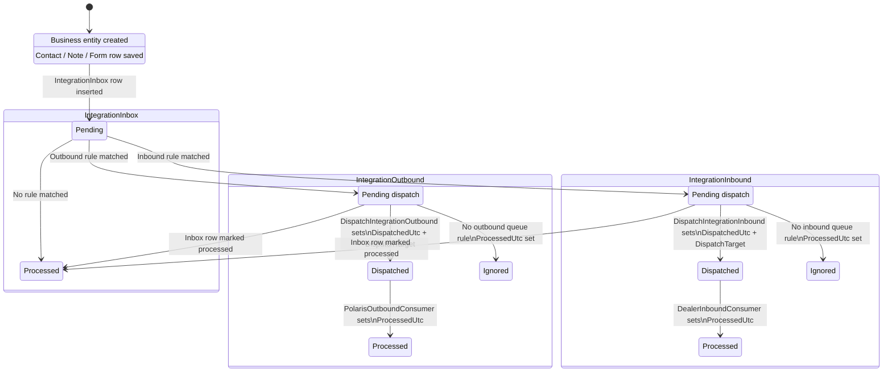

# Message Flow

This diagram shows the current end-to-end flow from an API write request through the inbox-processing pipeline and into the outbound or inbound queue consumers.

## Notes

- The API writes the business entity first and then writes an `IntegrationInbox` row in the same application workflow.
- `ProcessIntegrationInbox` is the routing step that decides whether an inbox item becomes an outbound message, an inbound message, or is ignored.
- `DispatchIntegrationOutbound` and `DispatchIntegrationInbound` are separate timer-triggered dispatch stages.
- The Service Bus consumer functions only complete the relevant integration row after a queue message is received and processed.
- The current queue names are `clientid4-inbound` for the Dealer inbound path and `clientid3-outbound` for the Polaris outbound path.

## Execution Order

This view focuses on when each function runs and the normal order you would enable and observe them locally.

## Suggested Local Run Order

1. Run the API and submit a request.
2. Enable and run `ProcessIntegrationInbox` to watch routing occur.
3. Enable and run `DispatchIntegrationOutbound` or `DispatchIntegrationInbound` depending on the expected route.
4. Enable and run the matching Service Bus consumer function to complete the integration row.

## Table State Transitions

This view focuses on how rows move through the integration tables.

### Meaning Of The Columns

- `IntegrationInbox.ProcessedUtc`: set when the inbox event has been classified.
- `IntegrationOutbound.DispatchedUtc` / `IntegrationInbound.DispatchedUtc`: set when a queue message has been sent.
- `IntegrationOutbound.ProcessedUtc` / `IntegrationInbound.ProcessedUtc`: set when the queue consumer has completed handling the message.
- `DispatchTarget`: stores the queue name used for dispatch, or `ignored` if no queue rule matched.