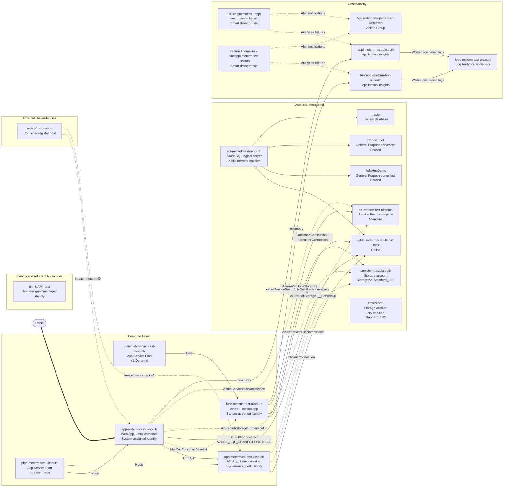

# rg-metcrm-test-uksouth Architecture

Subscription: Azure subscription 1 (`9ddc8c4b-0dfd-4300-9c31-48d6a582c2b4`)

Region: UK South

This resource group contains a small application platform centered on two Linux containerized App Service apps, one Azure Function App, a Service Bus namespace, and an Azure SQL logical server. The web app and API app share a Free Linux App Service plan, while the Function App runs on a separate Consumption plan.

The confirmed application flow is: the web app calls the API app and also has a configured base URL for the Function App. The web app, API app, and Function App all have configuration indicating use of Azure SQL, blob storage, and Service Bus. Observability is split across two Application Insights resources, both connected to a shared Log Analytics workspace.

Some resources in the group appear adjacent rather than central to the CRM workload, notably the `timtestazdl` ADLS-enabled storage account, the `tim_UAMI_test` user-assigned identity, and two paused databases on the shared SQL server. These are included for completeness, but no direct attachment to the core app topology was confirmed from the queried configuration.

## Resource Inventory

| Resource | Type | Key Details |
| --- | --- | --- |
| `app-metcrm-test-uksouth` | `Microsoft.Web/sites` | Linux container web app, system-assigned identity, image `metsoft.azurecr.io/metcrm:40` |
| `app-metcrmapi-test-uksouth` | `Microsoft.Web/sites` | Linux container API app, system-assigned identity, image `metsoft.azurecr.io/metcrmapi:40` |
| `func-metcrm-test-uksouth` | `Microsoft.Web/sites` | Function App, system-assigned identity |
| `plan-metcrm-test-uksouth` | `Microsoft.Web/serverfarms` | Shared App Service plan, `F1` Free, Linux |
| `plan-metcrmfunc-test-uksouth` | `Microsoft.Web/serverfarms` | Function plan, `Y1` Dynamic |
| `sb-metcrm-test-uksouth` | `Microsoft.ServiceBus/namespaces` | Service Bus namespace, Standard tier |
| `sql-metsoft-test-uksouth` | `Microsoft.Sql/servers` | Azure SQL logical server, public network access enabled |
| `sqldb-metcrm-test-uksouth` | `Microsoft.Sql/servers/databases` | Basic database, online, likely primary app database |
| `KulaHubDemo` | `Microsoft.Sql/servers/databases` | General Purpose serverless database, paused |
| `Cohort.Tool` | `Microsoft.Sql/servers/databases` | General Purpose serverless database, paused |
| `master` | `Microsoft.Sql/servers/databases` | System database |
| `sgmetcrmtestuksouth` | `Microsoft.Storage/storageAccounts` | StorageV2, Standard_LRS, Hot tier |
| `timtestazdl` | `Microsoft.Storage/storageAccounts` | StorageV2, Standard_LRS, Hot tier, HNS enabled |
| `appi-metcrm-test-uksouth` | `Microsoft.Insights/components` | Application Insights for web workload |
| `funcappi-metcrm-test-uksouth` | `Microsoft.Insights/components` | Application Insights for function workload |
| `logs-metcrm-test-uksouth` | `Microsoft.OperationalInsights/workspaces` | Shared Log Analytics workspace |
| `Application Insights Smart Detection` | `Microsoft.Insights/actionGroups` | Shared action group for smart detection alerts |
| `Failure Anomalies - appi-metcrm-test-uksouth` | `microsoft.alertsmanagement/smartdetectoralertrules` | Failure anomaly smart detector for web app telemetry |
| `Failure Anomalies - funcappi-metcrm-test-uksouth` | `microsoft.alertsmanagement/smartdetectoralertrules` | Failure anomaly smart detector for function telemetry |
| `tim_UAMI_test` | `Microsoft.ManagedIdentity/userAssignedIdentities` | User-assigned managed identity present in group |

## Architecture Diagram

## Relationship Details

- The web app is the main user entry point and has explicit configuration for the API app and the Function App base URL.
- The web app, API app, and Function App all expose configuration names that indicate use of Azure SQL, blob storage, and Service Bus.
- The web app and API app share the same Linux App Service plan, while the Function App runs on its own consumption plan.
- The web app is explicitly linked to `appi-metcrm-test-uksouth` through hidden-link tags. The Function App has an Application Insights connection string and a matching telemetry component `funcappi-metcrm-test-uksouth`.
- Both Application Insights resources are workspace-based and send telemetry to `logs-metcrm-test-uksouth`.
- Smart detector alert rules exist for both Application Insights components and use the shared `Application Insights Smart Detection` action group.
- The SQL logical server hosts multiple databases, but `sqldb-metcrm-test-uksouth` is the one most clearly aligned to the CRM workload by naming and active state.

## Notes

- `timtestazdl` is a valid ADLS Gen2-capable storage account in the same resource group, but no direct connection from the app settings queried here was confirmed.
- `tim_UAMI_test` exists in the group, but none of the three compute resources reported an attached user-assigned identity; they currently use system-assigned identities.
- The API app did not expose a separate Application Insights component in this resource group from the queries run here.
- The Mermaid diagram distinguishes between confirmed links and weaker inferences by using dashed arrows for configuration-driven or adjacent relationships.